Command:
git config --global user.name "Tharun"

Purpose:
Used to set the username for git commits.

Example:
git config --global user.name "Tharun Moturu"

Output:
Sets username globally for all repositories.

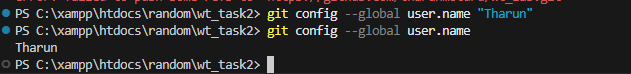

Command Name

git config --global user.email

Syntax
git config --global user.email "your_email@example.com"
Purpose

Sets the email address used for Git commits.

Example
git config --global user.email "tharun@gmail.com"
Explanation

This email is attached to every commit and helps identify the developer who made the change.

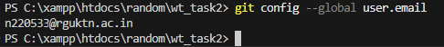

Command Name

git config --list

Syntax
git config --list
Purpose

Displays all Git configuration settings.

Example
git config --list
Explanation

Shows configured settings such as username, email, editor, and other Git preferences.

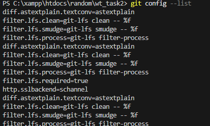

Command Name

git config --unset

Syntax
git config --unset user.name
Purpose

Removes a Git configuration setting.

Example
git config --unset user.email
Explanation

Deletes a configuration value from Git settings

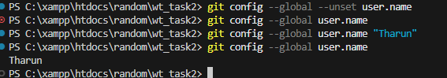

Command Name

git init

Syntax
git init
Purpose

Initializes a new Git repository.

Example
git init
Explanation

Creates a hidden .git folder that tracks version history of the project

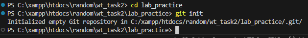

Command Name

git clone

Syntax
git clone <repository_url>
Purpose

Creates a copy of a remote repository.

Example
git clone https://github.com/tharunmoturu/wt_lab.git
Explanation

Downloads the repository from GitHub to the local machine.

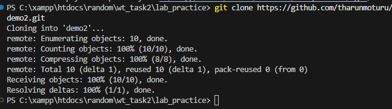

Command Name

git clone --branch

Syntax
git clone --branch <branch_name> <repository_url>
Purpose

Clones a specific branch from a repository.

Example
git clone --branch develop https://github.com/user/repo.git
Explanation

Only the selected branch is downloaded instead of the default branch.

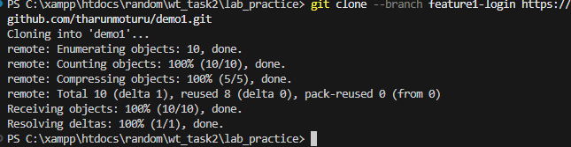

Command Name

git status

Syntax
git status
Purpose

Displays the current state of the repository.

Example
git status
Explanation

Shows modified files, staged files, and untracked files.

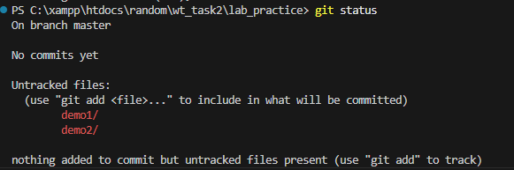

Command Name

git log

Syntax
git log
Purpose

Shows commit history.

Example
git log
Explanation

Displays detailed commit information including author, date, and message.

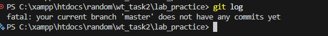

Command Name

git log --oneline

Syntax
git log --oneline
Purpose

Displays commit history in a compact format.

Example
git log --oneline
Explanation

Shows each commit as a single line with short commit ID and message.

Command Name

git log --graph

Syntax
git log --graph
Purpose

Displays commit history as a graphical branch structure.

Example
git log --graph
Explanation

Helps visualize branch merges and commit relationships.

Command Name

git show

Syntax
git show <commit_id>
Purpose

Displays details of a specific commit.

Example
git show 7db8d89
Explanation

Shows commit message, author, and changes made in that commit.

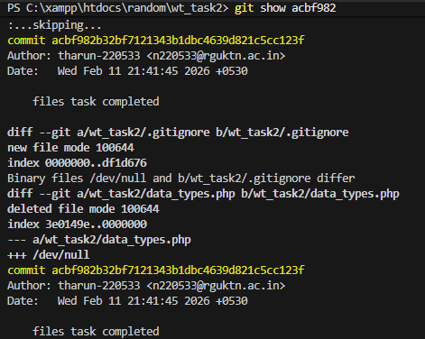

Command Name

git diff

Syntax
git diff
Purpose

Shows differences between file versions.

Example
git diff
Explanation

Displays added and removed lines in modified files.

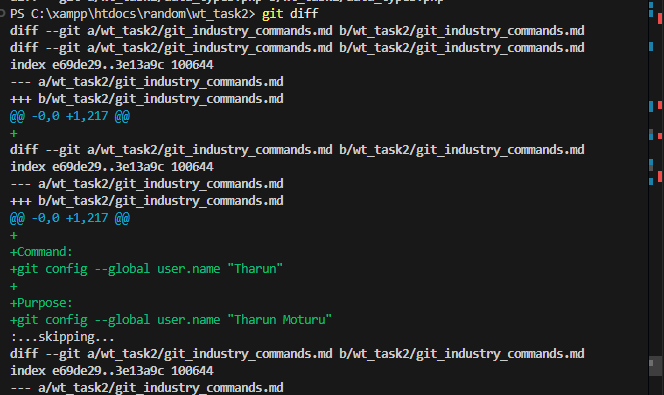
